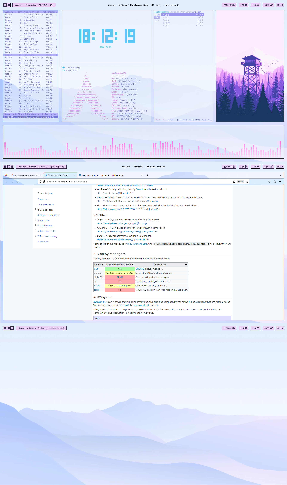

# Dotfiles

### Info
All files included in folder have to
be copied in home directory located on:

~/.config/

Including these folders:
- cava
- alacritty
- waybar
- sway

If you want to use only color-scheme from this,
I exported colors in .Xresources file.

You can use .Xresources file to export it
on your terminal configuration. Or you
could just export it on https//terminal.sexy

1. Main color scheme was generated through
python-wal with light scheme generation key.
After that color scheme was copied from ~/.cache/wal
directory, where wal saves last generated color
scheme

2. For waybar was added (custom/cmus) module, that
was copied with minor changes for waybar:
https://github.com/raytruong/polybar-cmus

To use this module, you have to copy cmus.sh script
in waybar config directory.

3. For wallpaper I used swaybg and swww utility.

///UPD
Polished configuration files
that you could refine it on your systems
Enjoy.

### raytruong
Bash script that fetches all needed paramaters from cmus-remote.
https://github.com/raytruong/polybar-cmus

### Images
#### Sway
Simple sway without compositor

